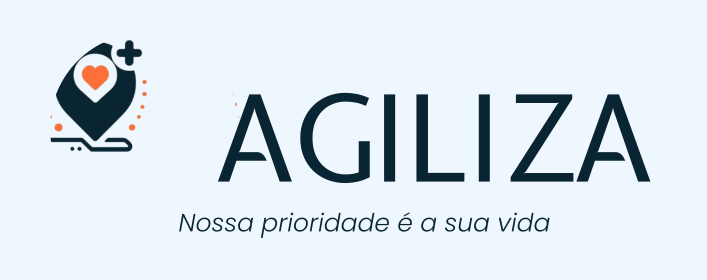

<h1>Agiliza</h1>

   

 

<!-- https://readme-typing-svg.herokuapp.com?font=Poppins&color=2C67F2&center=true&vCenter=true&lines=-+Inove+conosco+e+v%C3%A1+al%C3%A9m.+- -->

 

##

<h3 align="center">:writing_hand:	Fale conosco</h3>
 

